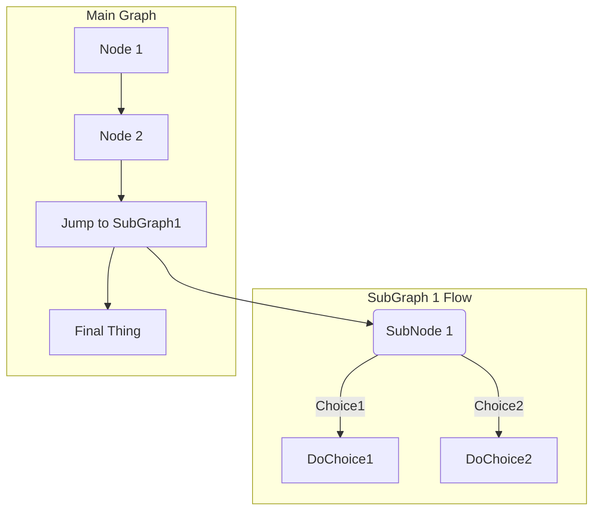

[![Contributors][contributors-shield]][contributors-url]
[![Forks][forks-shield]][forks-url]
[![Stargazers][stars-shield]][stars-url]
[![Issues][issues-shield]][issues-url]
[![MIT License][license-shield]][license-url]
[![LinkedIn][linkedin-shield]][linkedin-url]

<!-- PROJECT LOGO -->
<!DOCTYPE html>
<br/>
<p align="center">
    <a href="https://github.com/vinhtt95/getx_boilerplate">
        
    </a>

<h3 align="center">Flutter GetX Boilerplate</h3>
<p align="center">
    project_description
    <br/>
    <a href="https://github.com/vinhtt95/getx_boilerplate"><strong>Explore the docs »</strong></a>
    <br/>
    <br/>
    <a href="https://github.com/vinhtt95/getx_boilerplate">View Demo</a>
    ·
    <a href="https://github.com/vinhtt95/getx_boilerplate/issues">Report Bug</a>
    ·
    <a href="https://github.com/vinhtt95/getx_boilerplate/issues">Request Feature</a>
</p>


<!-- TABLE OF CONTENTS -->
<details open="open">
    <summary>Mục lục</summary>
    <ol>
        <li>
            <a href="#Giới-thiệu">Giới thiệu</a>
        </li>
        <li>
            <a href="#Bắt-đầu"> Bắt đầu</a>
            <ul>
                <li><a href="#Khởi-tạo-môi-trường">Khởi tạo môi trường</a></li>
                <li><a href="#Khởi-tạo-dự-án">Khởi tạo dự án</a></li>
            </ul>
        </li>
        <li><a href="#tài-liệu-dự-án">Tài liệu dự án</a></li>
        <li><a href="#Các-chức-năng">Các chức năng</a></li>
        <li><a href="#Pubs--Tool-đã-dùng">Pubs & Tools đã dùng</a></li>
        <li><a href="#Cấu-trúc-thư-mục">Cấu trúc thư mục</a>
            <ul>
                <li><a href="#Data">Data</a></li>
            </ul>
        </li>
        <li><a href="#acknowledgements">Acknowledgements</a></li>
    </ol>
</details>

<!-- ABOUT THE PROJECT -->

# Giới thiệu

Boilerplate này được tạo ra dựa trên nhu cầu thực tế khi thực hiện các dự án trước đó. Vì vậy, boilerplate sẽ được cập nhật thường xuyên.
Những chức năng có ở boilerplate là những chức năng mặc định cần có đối với mỗi dự án.
<!-- GETTING STARTED -->

# Bắt đầu

## Khởi tạo môi trường

* MacOS

* Home brew
  ```sh
  /bin/bash -c "$(curl -fsSL https://raw.githubusercontent.com/Homebrew/install/HEAD/install.sh)"
  ```
* Dart
  ```sh
  brew tap dart-lang/dart
  brew install dart
  ```

* Flutter
  ```sh
  brew install --cask flutter
  ```

* Cocoapods
  ```sh
  brew install cocoapods
  ```

## Khởi tạo dự án

1. Clone the repo
   ```sh
   git clone https://github.com/vinhtt95/getx_boilerplate.git
   ```
2. Cài đặt pub
   ```sh
   flutter pub get
   ```
# Tài liệu dự án

1. [SWR]()
2. [SRS]()
3. [SWD]()
4. [API Documentation]()
5. [Timeline]()

# Chức năng:

* Splash
* Login
* Home
* Routing
* Theme
* Dio
* Database
* MobX (to connect the reactive data of your application with the UI)
* Provider (State Management)
* Encryption
* Validation
* Code Generation
* User Notifications
* Logging
* Dependency Injection
* Dark Theme Support (new)
* Multilingual Support (new)
* Provider example (new)

## Up-Coming Features:

* Connectivity Support
* Background Fetch Support

## Pubs & Tools đã dùng

* [Dio](https://github.com/flutterchina/dio)
* [Database](https://github.com/tekartik/sembast.dart)

## Cấu trúc thư mục

```
lib/
|- constants/
|- data/
|- stores/
|- ui/
|- utils/
|- widgets/
|- main.dart
|- routes.dart
```

Giải thích cấu trúc - nhiệm vụ các thành phần

```
1- constants - All the application level constants are defined in this directory with-in their respective files. This directory contains the constants for `theme`, `dimentions`, `api endpoints`, `preferences` and `strings`.
2- data - Contains the data layer of your project, includes directories for local, network and shared pref/cache.
3- stores - Contains store(s) for state-management of your application, to connect the reactive data of your application with the UI. 
4- ui — Contains all the ui of your project, contains sub directory for each screen.
5- util — Contains the utilities/common functions of your application.
6- widgets — Contains the common widgets for your applications. For example, Button, TextField etc.
7- routes.dart — This file contains all the routes for your application.
8- main.dart - This is the starting point of the application. All the application level configurations are defined in this file i.e, theme, routes, title, orientation etc.
```


### Data

All the business logic of your application will go into this directory, it represents the data layer of your application. It is sub-divided into three directories `local`, `network` and `sharedperf`, each containing the domain specific logic. Since each layer exists independently, that makes it easier to unit test. The communication between UI and data layer is handled by using central repository.

```
data/
|- local/
    |- constants/
    |- datasources/
    |- app_database.dart
|- network/
    |- constants/
    |- exceptions/
    |- rest_client.dart
|- sharedpref
    |- constants/
    |- shared_preference_helper.dart
|- repository.dart
```

<!-- ACKNOWLEDGEMENTS -->

## Acknowledgements

* [Mastering Markdown](https://guides.github.com/features/mastering-markdown/)
* [Best-README-Template](https://github.com/othneildrew/Best-README-Template#built-with)

<!-- MARKDOWN LINKS & IMAGES -->
<!-- https://www.markdownguide.org/basic-syntax/#reference-style-links -->

[contributors-shield]: https://img.shields.io/github/contributors/vinhtt95/repo.svg?style=for-the-badge

[contributors-url]: https://github.com/vinhtt95/getx_boilerplate/graphs/contributors

[forks-shield]: https://img.shields.io/github/forks/vinhtt95/repo.svg?style=for-the-badge

[forks-url]: https://github.com/vinhtt95/getx_boilerplate/network/members

[stars-shield]: https://img.shields.io/github/stars/vinhtt95/repo.svg?style=for-the-badge

[stars-url]: https://github.com/vinhtt95/getx_boilerplate/stargazers

[issues-shield]: https://img.shields.io/github/issues/vinhtt95/repo.svg?style=for-the-badge

[issues-url]: https://github.com/vinhtt95/getx_boilerplate/issues

[license-shield]: https://img.shields.io/github/license/vinhtt95/repo.svg?style=for-the-badge

[license-url]: https://github.com/vinhtt95/getx_boilerplate/blob/master/LICENSE.txt

[linkedin-shield]: https://img.shields.io/badge/-LinkedIn-black.svg?style=for-the-badge&logo=linkedin&colorB=555

[linkedin-url]: https://linkedin.com/in/vinhtt95
